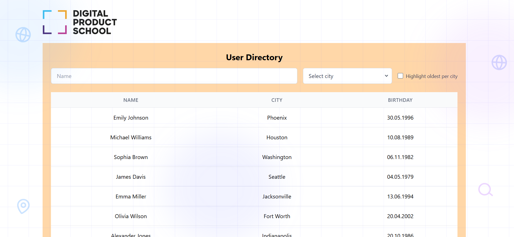

# DPS Frontend Coding Challenge

## Overview

This repository contains a very basic web application based on Typescript and React. Main application file is `App.tsx`. Node and npm are required.

## Environment Setup

Ensure you have Node.js (v14.x or later) and npm (v6.x or later) installed.  
To set up and run the application, execute the following commands:

```
npm install
npm run dev
```

The application will then be accessible at http://localhost:3000.

## Project Context

You will be enhancing a new CRM (Customer Relationship Management) software aimed at managing customer data efficiently. Your task is to develop a feature that displays a searchable list of customers.

Refer to the attached mockup image to guide your UI development 👇


## Challenge Tasks

-   **Fork this project:** Start by forking this repository
-   **UI Implementation:** Implement the user interface according to the provided design mockup.
-   **Data Integration:** Utilize the endpoint https://dummyjson.com/users to fetch user data. If no filter is applied all data is displayed.
-   **Client-side Filtering:** Implement the following filters:
    -   **Name Filter:** An input field that dynamically filters by `firstName` or `lastName` as you type.
    -   **City Filter:** A dropdown that lists all cities present in the data. Users can select a city to filter the list accordingly.
    -   **Highlight Feature:** A checkbox that when checked, highlights the oldest users within each city (use data field `city`)
    -   **Optional:** Implement a 1-second debounce on the Name Filter input. This means the application should delay the filter action until 1 second has passed without any further input from the user. This optimization helps reduce the number of processing calls, enhancing performance.
-   **Submission:** After completing the challenge, email us the URL of your GitHub repository.
-   **Further information:**
    -   If there is anything unclear regarding requirements, contact us by replying to our email.
    -   Use small commits, we want to see your progress towards the solution.
    -   Code clean and follow the best practices.

\
Happy coding!


---

### 📌 **User Directory tracker**  
_A lightweight Customer Relationship Management application with filtering, search, and api connections._

  

## 🚀 **Project Overview**  
**CRM** is a Customer Relationship Management **Build with React, TypeScript, and the Context API**. It allow users to filter usrers and leverage a debounce feature.  

### 🎯 **Core Features**  
✅ **Search Functionality:** Search tasks dynamically as you type (with debounce)   
✅ **Global State Management:** Uses **Context API** for  filters  
✅ **Testing:** Unit tests for core components using **Vitest**  
✅ **Modern UI:** Styled with Tailwind CSS  

---

## ⚡ **Getting Started**  

### **1️⃣ Clone the Repository**  
```sh
git clone https://github.com/pehjos/dps-react-challenge.git
cd dps-react-challenge
```

### **2️⃣ Install Dependencies**  
```sh
yarn install
```

### **3️⃣ Run the Development Server**  
```sh
yarn dev
```
Open [http://localhost:5173](http://localhost:5173) to see the app.

### **4️⃣ Run Tests**  
```sh
yarn test
```

### **5️⃣ Lint & Fix Issues**  
```sh
yarn lint
yarn lint:fix
```

### **6️⃣ Build for Production**  
```sh
yarn build
```

---

## 🏗 **Project Structure**
```
dps-react-challenge/
src/
│── assets/            # Static assets like images, icons, fonts
│── component/        # React components (UI elements)
│── context/           # Context API for global state management
│── tests/             # Unit tests for components and logic
│── types/             # TypeScript type definitions
│── App.tsx            # Root component of the application
│── index.css          # Global styles
│── main.tsx           # Application entry point (ReactDOM rendering)
│── setupTests.ts      # Test setup file for Vitest/Jest
│── vite-env.d.ts      # Vite environment types
│── .gitattributes     # Git attributes configuration
│── .gitignore         # Ignored files for Git
│── eslint.config.js   # ESLint configuration for code quality
│── index.html         # Main HTML template file
│── package.json       # Project dependencies and scripts
│── README.md          # Documentation for the project
│── tsconfig.app.json  # TypeScript config for the app
│── tsconfig.json      # Base TypeScript configuration
│── tsconfig.node.json # TypeScript config for Node-related tasks
│── vite.config.ts     # Vite configuration file
```

---

## 🛠 **Code Quality & Best Practices**
This project follows strict **ESLint** rules with **TypeScript support**, enforcing **clean, maintainable, and bug-free** code.  

### ✅ **Code Rules & Enforced Standards**
```json
"rules": {
  "semi": ["error", "always"],
  "quotes": ["error", "double"],
  "react/react-in-jsx-scope": "off",
  "react/prop-types": "off",
  "@typescript-eslint/no-explicit-any": "error",
  "@typescript-eslint/explicit-module-boundary-types": "error", 
  "@typescript-eslint/explicit-function-return-type": "error",
  "no-console": ["error", { "allow": ["warn", "error"] }],
  "@typescript-eslint/no-unused-vars": ["error", { "argsIgnorePattern": "^_", "varsIgnorePattern": "^_" }],
  "@typescript-eslint/no-unused-expressions": ["error", { "allowShortCircuit": true, "allowTernary": true }]
}
```
### ✅ **Pre-commit Hooks with Husky**
- Runs **ESLint & Tests** before commits  
- Ensures high-quality code is pushed to the repository  

---

## 🏆 **Git Workflow & Branching Strategy**
We follow a **Git best practice workflow** to ensure clean and manageable code.

### 🔄 **Branching Strategy**
- `master` → Stable production-ready branch  
- `develop` → Ongoing development work  
- `feature/*` → New features (merged into `develop`)  
- `bugfix/*` → Fixes for reported issues  
- `hotfix/*` → Critical fixes for `main`  

### 📜 **Git Commit Guidelines**
✅ **Small, Focused Commits** – Each commit should address **one** change  
✅ **Descriptive Commit Messages** – Example:
```
feat: added priority filter for tasks
fix: fixed issue with task search debounce
refactor: optimized task storage with useMemo
```

---

## 🔄 **CI/CD Pipeline: Automated Testing & Linting**
This project includes a **CI/CD pipeline** with **GitHub Actions** to automate linting & testing.

### ✅ **Pipeline Overview**
1️⃣ **Runs on push/pull requests** to `main` and `develop`  
2️⃣ **Installs dependencies** (`yarn install`)  
3️⃣ **Runs ESLint** to check code quality  
4️⃣ **Runs Tests** (`yarn test`) to ensure functionality  

### 📝 **GitHub Actions Workflow (`.github/workflows/ci.yml`)**
```yaml
name: CI Pipeline

on:
  push:
    branches:
      - master
      - develop
  pull_request:
    branches:
      - master
      - develop

jobs:
  lint-and-test:
    name: 🔍 Lint & Test
    runs-on: ubuntu-latest

    steps:
      - name: 🛎 Checkout repository
        uses: actions/checkout@v4

      - name: ⚙️ Set up Node.js
        uses: actions/setup-node@v4
        with:
          node-version: 18
          cache: "yarn"

      - name: 📦 Install dependencies
        run: yarn install --frozen-lockfile

      - name: 🚨 Run ESLint
        run: yarn lint

      - name: 🧪 Run Tests
        run: yarn test
```


## 💡 **Approach & Technical Decisions**
- **React + TypeScript** for **type safety & maintainability**
- **Context API** for **global state management**
- **useState & useEffect** for **state handling**
- **Vitest** for **unit testing**
- **Debounce in Search Input** for **better UX**
- **Husky & ESLint** for **code quality enforcement**


---
